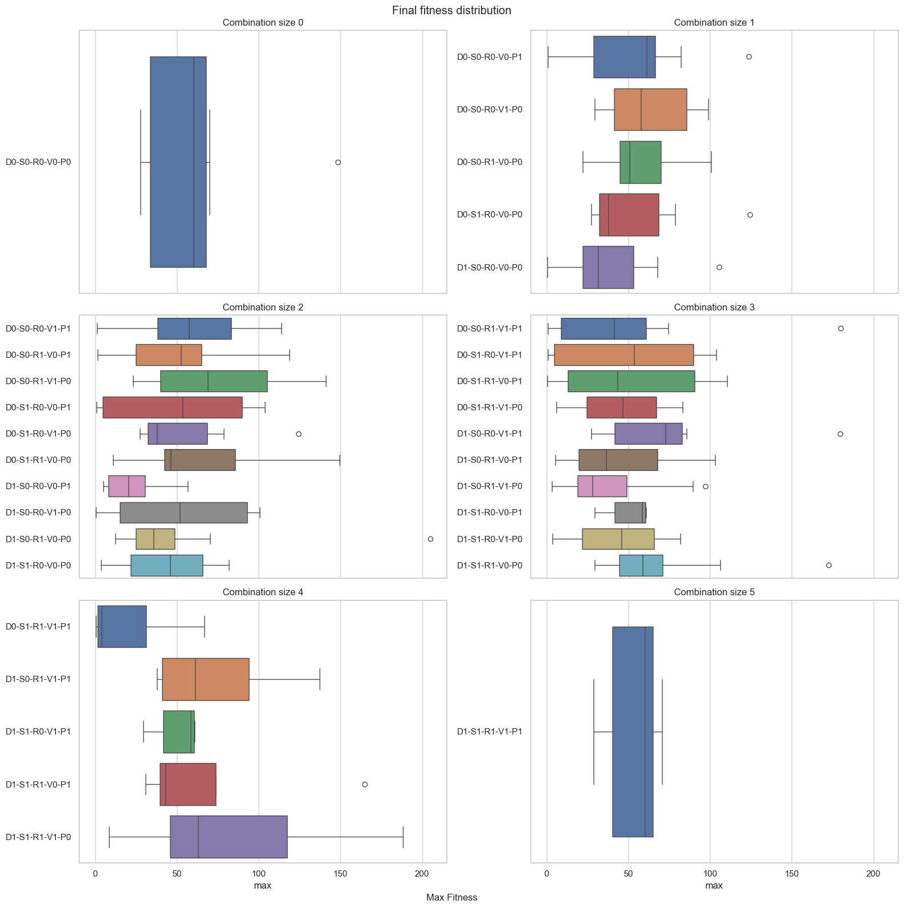

# frams-gecco-2024

This repository stores the code developed by our team for the 2024 Framstics GECCO competition.

The team:

- Agata Żywot
- Zuzanna Gawrysiak
- Bartosz Stachowiak
- Daniel Jankowski
- Kacper Dobek

### How to run the algorithm ###

We copied all the necessary framspy scripts into this directory. The only external component is the Framsticks simulator directory `FRAMSTICKS_SIMULATOR_PATH` that needs to be provided in the command below.

To run the algorithm in the competition setup, please use the following command:

```bash
python  frams_evolve.py \
        -path FRAMSTICKS_SIMULATOR_PATH \
        -sim "eval-allcriteria.sim;deterministic.sim;recording-body-coords.sim" \
        -opt COGpath \
        -popsize 50 \
        -generations 2000 \
        -genformat 0 \
        -rand_prob 0.01 \
        -mutator_ub 5.0
```

### The approach

We developed a few mechanisms to improve the basic evolutionary algorithm from DEAP (eaSimple). After a thorough analysis of their performance we decided to use two of them in the submission. Namely, a mechanism that repeats mutation if the evolution process stagnates and another mechanism that supplements the population with randomly generated solutions.



### Dependencies ###

The algorithm uses no external libraries different than the standard framspy package. However, in the case of problems with a script execution, the `requirements.txt` is provided.